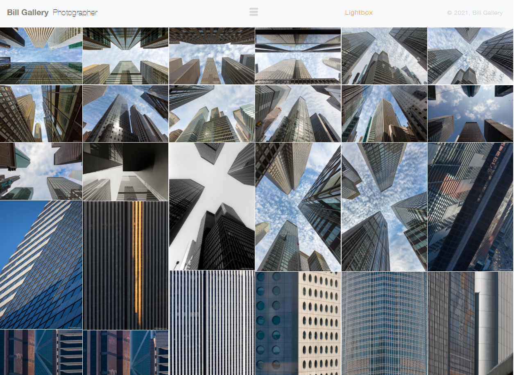

Mosaic Tiling Plugin
===================
This is a simple javascript plugin that lets you show images in a mosaic layout. It has some expandability, which can make adding in lazy loading classes easy & simple.

What is mosaic tiling?
-------------------
Mosaic tiling is a simple feature that allows you to load images as compactly as possible in a given space.

Here's an example:

> Photo taken from [Bill Gallery's Website](https://www.billgallery.com/)

What is the purpose of this plugin?
-------------------
The reason I wrote this plugin was for a client. He had wanted a mosaic tiling styled page for his photography, but he also wanted 
to keep control of the order the images were in. Most mosaic tiling plugins work wonderfully, however their fault is that there is usually no way to keep images shown
in the order you feed them to the plugin. 

This plugin solves this issue by showing images in the order you feed them in (left to right, top to bottom...). The **downside** to this method is that at the bottom
of the page, the images can generally get pretty funky looking and out of order.

This plugin is very simply written and easy to expand, so the overall functionality can be altered by anyone who uses it fairly easily. 

How To Use
==================
This plugin was written to be really easy to use and expand upon. Here's how...

Options
------------------
There are several options for the user to alter, in hopes of keeping the plugin very easy to use:
* **container**:        The container is the **ID** for the overall div that the plugin is using to write all the elements out to. This will be emptied by the plugin when the loading functionality is called. Default value:  `masonryContainer`

* **masonryColumn**:    This is the **class** applied to each 'column' in the container. Default value: `masonryColumn`
* **masonryImgDiv**:    This is the **class** applied to each div containing an image. Mostly here for expandability, I personally used it for lazy loading. Default value: `masonryImgDiv`
* **masonryImg**:       This is the **class** applied to each image. Default value: `masonryImg` 
* **columns**:          This is an **int** representing the number of columns that will be generated by the plugin. I've chosen to simply include this here instead of hard coding it in so that people can decide how many columns they'll want/need. This can be expanded very easily as well to include more breakpoints etc., but for my own purposes this was enough. Default value: `6`
* **mobileColumns**:    This is an **int** that represents the number of columns that will appear when the window width is less than the cutoff number (*specified next*). Pretty simple, but can be expanded further in the plugin. Default value: `3`
* **smallCutoff**:      This is an **int** that represents the window width where the screen will switch the number of columns to the mobileColumns value specified above. Default value: `800`
* **imagesJson**:       As the name implies, the JSON that will contain all of the image links. Default value: `null`
* **lazyLoading**:      This controls whether or not the images fed into the plugin will show by default or not. It will set the default src img to a simple spinner if set to **true**, and will set the image itself if set to **false.** Default value: `false`

All of these values will use default values unless specifically modified in the plugin constructor. Speaking of which...

Plugin Constructor
------------------
To instantiate the plugin, simply include the plugin's main file and do the following after:

`var mosaic = new mosaicLayout({ container: "masonryContainer"});`

`mosaic.loadImages();`

